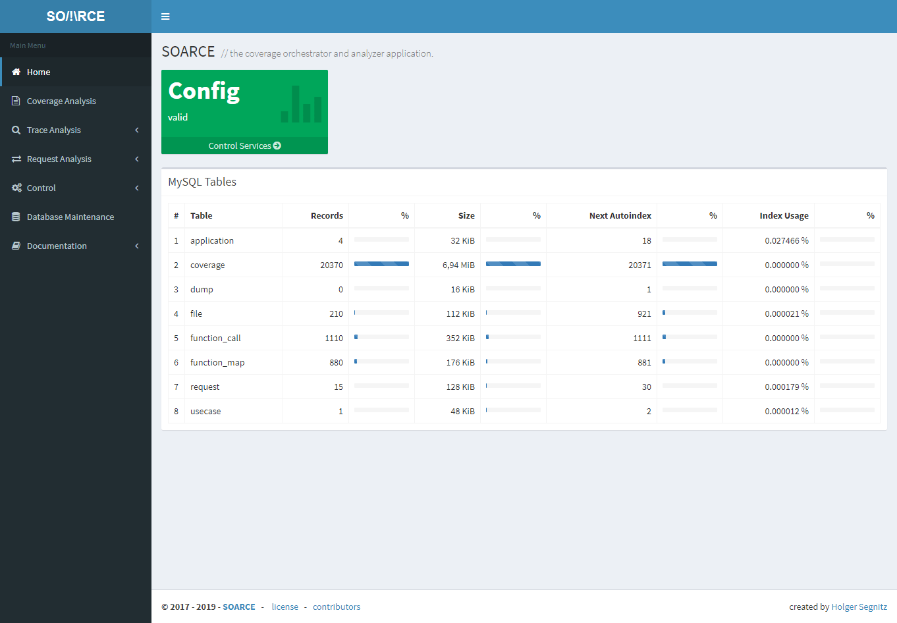
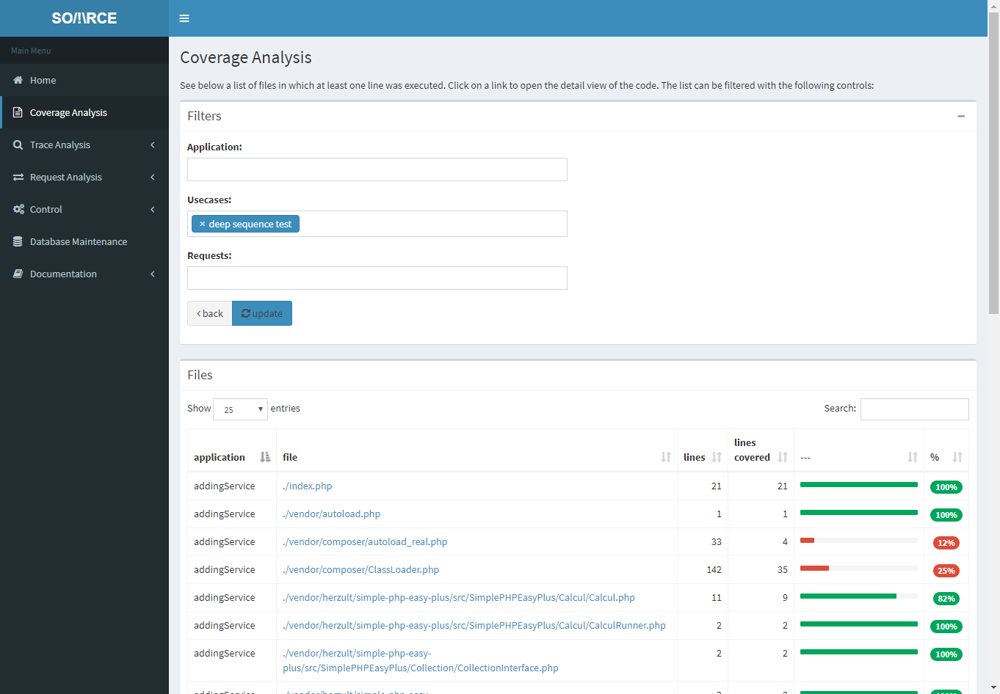
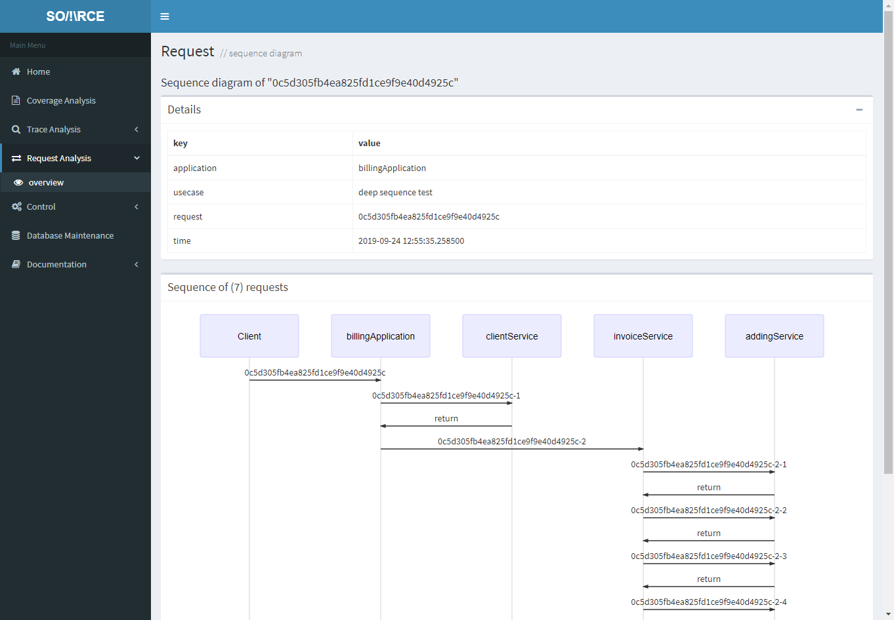
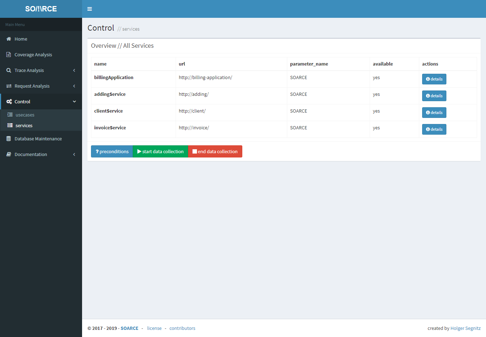

# Welcome to SOARCE

## Introduction

SOARCE is a combination of a web application and a composer package that aims to bring
clarity into the fog of legacy applications that have any combination of the following flaws:
undocumented or wrongfully documented source, no unit tests, heavy use of global and/or static
variables, magic methods, hooks, ... and since we liked the challenge, applications that are
split into (micro)services.

With SOARCE, for most cases, all you need to do is install one dev-requirement into each of your
services or applications, make sure xdebug is available in their docker containers and then
fire up and config the main SOARCE application. Our goal was to make this as minimal invasive
as possible..

After doing so, you will be able to run any integration or end-to-end test suite and have SOARCE
automatically gather and analyse a lot of helpful information in real time in the background: 
Code coverage, function call traces, request parameters and service call sequences.

The SOARCE web application provides a set of helpful views on the collected data with a set of
filters to make searching easy and also reduce noise:

* **Code Coverage** will be stored with a granularity of "request within a use case". This means
that you can look at the coverage of an individual request (or any number), of a usecase (or many)
or the whole test suite.
* The same is valid for **function calls**. You cen look at all of them or filter them down. For
functions you will also be able to see callers and callees for each function and the frequency.
* SOARCE is also able to not only track **HTTP requests** but draw a **sequence diagram** for all
subsequent calls within the topmost/main one.

## Screenshots

[more screenshots...](screenshots.html)

## Requirements

### Application / Server
* Docker
* Docker-Compose
* Composer

### Plugin / Client
* PHP >= 5.3.9
* xdebug
* a linux vm or docker container for the application
* composer autoloader for the automatic mode to work
